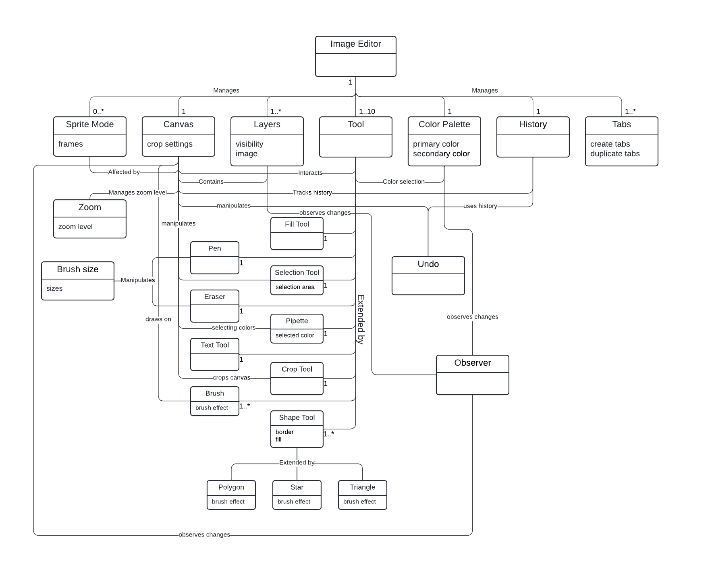
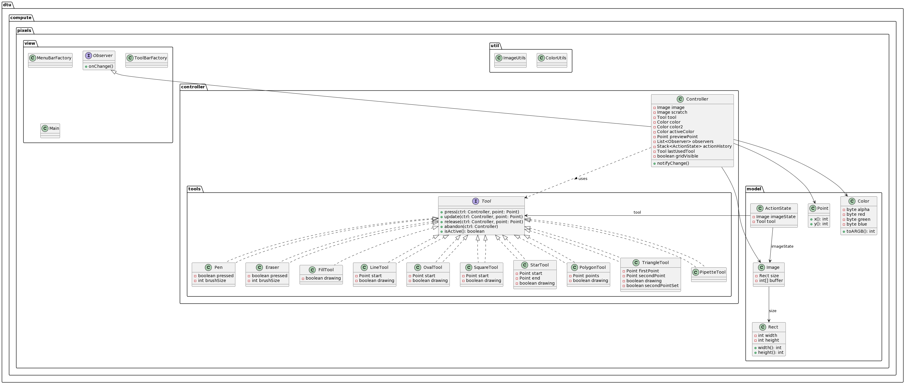
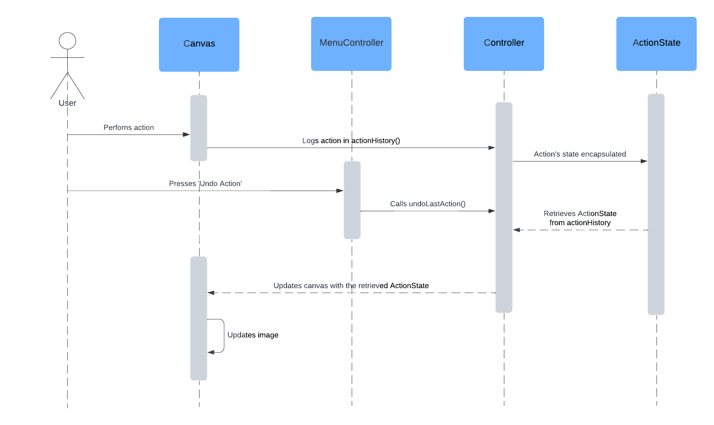
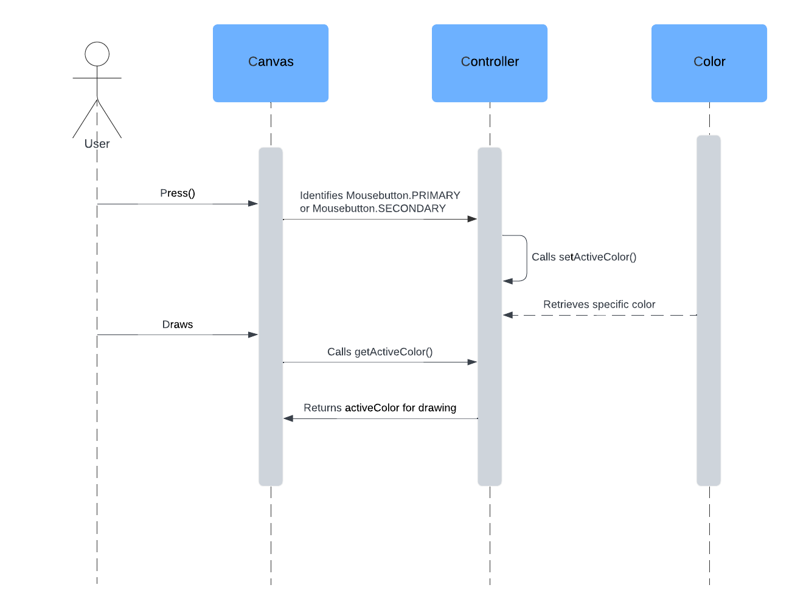
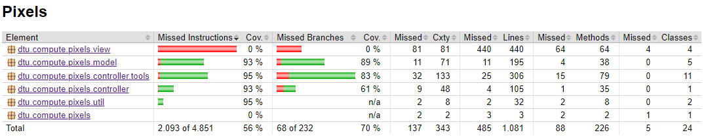

# Rapport (Gruppe 19)

### Indledning

Velkommen til rapporten om "Pixels" - et produkt af visionær tænkning og teknologisk finesse, hvor vi stolt fremviser resultatet af vores utrættelige stræben efter at skabe et tegneprogram, der ikke blot opfylder, men overgår forventningerne. "Pixels" er mere end blot et digitalt lærred; det er et univers af kreativitet, hvor hver eneste detalje er nøje overvejet og udført med præcision.

Vores stolthed over "Pixels" skyldes ikke mindst de unikke og avancerede funktioner, vi har integreret. Forestil dig muligheden for at skabe komplekse figurer som ovaler, polygoner og meget mere med enestående præcision og lethed - en funktion, der forvandler det digitale rum til et værksted for kunstnerisk frihed. Denne funktionalitet er ikke kun et teknisk mesterværk, men også et vidnesbyrd om vores forståelse for kunstnernes og designernes behov.

Zoom-funktionen i "Pixels" er en anden vigtig bedrift. Denne mulighed for at dykke ned i de fineste detaljer af et værk giver brugerne mulighed for at udforske og perfektionere deres skaberværk med en hidtil uset præcision. Denne funktion underbygger vores løfte om at give brugerne fuld kontrol over deres kreative udtryk.

Bindingsfunktionen, der tillader brug af to forskellige farver gennem højre- og venstreklik, er et vidnesbyrd om vores innovative tilgang. Denne funktion optimerer arbejdsprocessen og giver en intuitiv og dynamisk brugeroplevelse. Det er en subtil, men kraftfuld, forbedring, der afspejler vores forståelse for brugernes arbejdsflow og kreative processer.

Og så er der vores undo-knap - en funktion, der repræsenterer mere end blot en simpel tilbagevenden til et tidligere trin. Det er en gateway til udforskning og eksperimentering, en sikkerhedsnet, der opmuntrer vores brugere til at tage kreative risici uden frygt for at lave irreversible fejl. Dette er et eksempel på, hvordan vi inkorporerer brugerforståelse i vores design - en forståelse for, at den kreative proces ofte er iterativ og eksperimenterende.

Vores engagement i kvalitet og præcision fremgår tydeligt af vores omfattende Unittests og Accepttests. Vi har ikke blot bygget "Pixels" med et ønske om funktionalitet; vi har skabt det med en sikkerhed om, at hver eneste komponent fungerer som forventet. Disse tests er ikke bare en del af vores udviklingsproces; de er en manifestation af vores forpligtelse til pålidelighed og kvalitet.

I denne rapport vil du finde en dybdegående gennemgang af disse funktioner og meget mere. Vi vil lede dig gennem vores designbeslutninger, udviklingsprocesser og de tekniske udfordringer, vi har overvundet. Vi vil demonstrere, hvordan "Pixels" ikke bare er en milepæl i softwareudvikling, men en revolution inden for digital kunst og design.

Sæt dig tilbage, og lad os sammen udforske "Pixels" - et værktøj, som vi er ufatteligt stolte af at præsentere. Gennem denne rapport vil vi dele vores passion, vores indsigt og den indsats, der har gjort "Pixels" til en realitet - en platform, der ikke bare afspejler, hvad vi har opnået, men også, hvad der er muligt i skæringspunktet mellem teknologi og kreativitet.

### Kravsanalyse / Problemet

> *Hvad er problemet?*

For at skabe et malerprogram, der opfylder kundens behov, står vi over for en række udfordringer og ønsker, der skal integreres i vores softwareløsning. Vores kunde, der specialiserer sig i design af logoer, plakater og posters, har brug for avancerede redigeringsfunktioner, som kan arbejde med 600x600 billeder og understøtter skabelsen af præcise geometriske figurer, såsom lige streger, rektangler og ovaler (US17, US18 og US19). Dette er afgørende for deres arbejde med logoer, hvor dimension og dybde (US14) kan blive en sekundær bekymring.

Kunden lægger stor vægt på tekstmanipulation, hvilket gør Text Tool (US06) og Pen effects (US07) til væsentlige tilføjelser. Den visuelle nøjagtighed er yderligere forbedret ved hjælp af hjælpelinjer og gitre, som gør det muligt for brugeren at tilføje tekst og andre elementer med præcision. At kunne blødgøre skarpe kanter (US20) er også en funktion, som vores kunde efterspørger for at tilføje finesser til deres designs.

Layers (US05) er en anden nøglekomponent, som vores kunde har udtrykt et behov for. Det giver dem mulighed for at arbejde med flere elementer samtidig og skabe komplekse designs. I forlængelse af dette er funktionaliteten af et ikonbaseret interface, der gør det nemmere at vælge værktøjer som Pen (US10), og evnen til at male med to farver samtidig, noget vores kunde er interesseret i. Mouse-key bindings (US22) vil give mulighed for yderligere tilpasning og effektivitet i arbejdsflowet, hvilket er særlig vigtigt for en bruger, der anvender mange forskellige hurtigtaster og museklik.

For at understøtte en bred vifte af redigeringsmuligheder, skal vi også inkludere Fill Tool (US09), der gør det muligt at udfylde områder med farve, og Eyedropper Tool (US25), som gør det muligt at vælge farver direkte fra canvas. Disse værktøjer vil være en del af et mere omfattende Color Palette-system, som giver brugeren mulighed for at vælge og manipulere farver præcist. Tilpasning af canvas størrelse og beskæring af billeder (US26) er også en funktion, der er ønsket for at give brugerne mulighed for at finjustere deres arbejdsområde.

For at understøtte arbejdet med flere projekter samtidigt er der behov for en Tab-funktionalitet (US24), som tillader brugeren at have flere billeder åbne og nemt skifte imellem dem. Figure Tool (US23) vil give brugerne mulighed for at tegne komplekse figurer som polygoner, stjerner og trekanter, hvilket yderligere udvider programmets anvendelsesmuligheder.

Disse krav og ønsker til funktionalitet er sammenkædet i vores domænemodel, som viser sammenhængen mellem de forskellige aspekter af programmet. Domænemodellen skal fungere som en vejledning for, hvordan de forskellige komponenter og værktøjer skal interagere, og hvordan brugerens handlinger skal afspejles i programmets forskellige lag og funktioner. Ved at sikre, at vores løsning er udviklet med denne model i tankerne, kan vi skabe et malerprogram, der ikke bare opfylder kundens nuværende krav, men også er fleksibelt nok til at tilpasse sig fremtidige behov.

________
**Bruger analyse**

Vi har allerede beskrevet hvilke funktioner vores kunde har brug for, for at gøre Pixels til et succesfuldt produkt, men med et tegneprogram af denne kaliber er mulighederne uendelige og markedet er større end forventet. Vi har derfor tilladt os at undersøge og analysere lidt udenfor kundens typiske bruger.

 - Casual bruger: 
    - Brug: Primært til fritid og leg, kreative projekter og billedredigering.
    - Behov: Brugervenlig Interface, simple værktøjer som pen og eraser, color selection og undo function.
 - Grafisk designer: 
    - Brug: Større projekter med komplekse designs og logo design
    - Behov: En bred vifte af værktøjer til at skabe designs efter kundens ønsker, eksempelvis color bindings, brush sizes og gradients.
    Derudover vil funktioner der kan manipulere canvas såsom cropping tool, layers og tabs være vigtige for et godt workflow.
 - Animator: 
    - Brug: Frame-by-frame redigering
    - Behov: Sprite Mode vil være essentielt for denne type bruger, så der nemt kan skabes længere sekvenser af stilbilleder til animatonsserier og lignende.
 - Digital kunster/maler: 
    - Brug: Primært til fremstilling af unikke kunstværker.
    - Behov: For at kunne efterligne rigtige malerier er der behov for værktøjer som brush effects, blending tool, layers og en udvidet color palette.
 - Billede editor: 
    - Brug: Forbedring og manipulation af billeder.
    - Behov: Værktøjer som cropping tool, pipette og zoom effekt vil være en fordel for brugeren
 - Underviser: 
    - Brug: Fremføre undervisning med programmets værktøjer og teknikker.
    - Behov: Funktioner der er nemme at demonstrere samt et bruger-interface der gør det nemt at følge med i undervisningen.   
    
**Et tegneprogram i teorien**

Et tegneprogram er designet med henblik på at efterligne den fysiske tegneoplevelse, samtidig med at de tilføjer de fordele, der følger med digital teknologi. Den overordnede funktionalitet af et tegneprogram kan opdeles i flere nøglekomponenter:

- Brugerinterface (UI): Et rent og intuitivt interface er afgørende. Det giver brugerne nem adgang til forskellige værktøjer og indstillinger, som er afgørende for skabelsen af digitale kunstværker. UI skal være både enkelt nok til at ikke overvælde nye brugere og kraftfuldt nok til at tillade hurtig adgang til avancerede funktioner for erfarne brugere.

- Billed- og Laghåndtering: Et centralt koncept i digitale tegneprogrammer er brugen af lag. Hvert lag kan ses som en transparent folie, hvor kunstneren kan tegne eller tilføje elementer. Lagene kan organiseres, justeres og manipuleres uafhængigt, hvilket giver en enorm fleksibilitet og kontrol over det samlede billede.

- Tegne- og Malerværktøjer: For at imødekomme de forskelligartede behov hos kunstnere, tilbyder tegneprogrammer et bredt udvalg af tegne- og malerværktøjer. Disse værktøjer kan variere fra simple pensler til komplekse former og teksturer, og de simulerer ofte realistiske medier som akvarel, olie og blyant.

- Præcision og Detaljeorientering: Funktioner såsom zoomeværktøjer, hjælpelinjer og gitre er afgørende for at skabe detaljeret og præcist arbejde. Disse funktioner er især vigtige, når man arbejder med grafisk design, hvor nøjagtighed er afgørende.

- Farvehåndtering: En avanceret farvepalette er nødvendig for at skabe visuelt slående billeder. Designere skal kunne vælge, justere og manipulere farver med stor nøjagtighed for at opnå det ønskede udtryk.

- Historik- og Versionskontrol: Evnen til at fortryde eller genskabe handlinger er en væsentlig del af digitale tegneprogrammer. Dette giver kunstnere friheden til at eksperimentere og udforske forskellige kreative stier uden bekymring for at miste deres fremskridt.

- Optimering for Ydelse og Deling: I en verden, der er mere og mere forbundet, skal tegneprogrammer tillade effektiv lagring, eksport og deling af digitale kunstværker. Dette omfatter understøttelse af forskellige filformater og integration med andre platforme og tjenester.

**Prioritering af User Stories**

Dette er vores indledende prioritering, den afspejler ikke hvordan vores produkt vil ende, men hvordan vores indledende tanker er om kravene og opgaven.

>Must Have

Disse er essentielle for et grafisk designfirma, der fokuserer på logoer og plakatskabelse.

- US01 (Læse PNG-billeder): Afgørende for at importere eksisterende designs eller aktiver.
- US02 (Gemme billeder): Kritisk for at bevare arbejde og dele designs med klienter.
- US03 (Fortryde handlinger): Grundlæggende for en strømlinet designproces, der tillader designere at omgøre ændringer nemt.
- US04 (Zoome ind/ud på lærredet): Nødvendigt for detaljeret arbejde på logoer og plakater.
- US05 (Arbejde med lag): Afgørende for komplekse billedkompositioner og organisering.
- US06 (Tilføje tekst til billeder): Essentiel for plakatskabelse og tilføjelse af tekstuelle elementer til designs.
- US10 (Vælge forskellige penselstørrelser): Vigtigt for præcision i at skabe og ændre designs.
- US11 (Vælge og flytte dele af tegningen): Grundlæggende for at finjustere layouts og kompositioner.
- US12 (Rotere og transformere valgte områder): Nødvendigt for at justere elementer i logoer og plakater.
- US14 (Skabe gradienter): Ofte brugt i logo- og plakatdesign for visuelle effekter og dybde.
- US15 (Aktivere hjælpelinjer og gitre): Afgørende for præcist at placere elementer i designs.
- US24 (Arbejde på flere faner/projekter samtidigt): Kritisk for produktivitet og håndtering af flere projekter.

>Should Have

Vigtige, men ikke kritiske for den umiddelbare lancering, kan inkluderes i næste fase.

- US07 (Forskellige pensel effekter): Forbedrer alsidigheden af design men ikke kritisk for basal funktionalitet.
- US08 (Brug af viskelæder værktøj): Nyttigt for rettelser, men lignende funktionalitet kan opnås med fortryde funktionen eller en hvid pensel.
- US09 (Brug af fyldværktøj): Forenkler designprocessen men ikke essentiel for den indledende udgivelse.
- US13 (Spejltegning-funktion): Nyttig for symmetriske designs men ikke en primær krav.
- US17 (Streg værktøj): Letter tegning af lige linjer, vigtigt men ikke kritisk.
- US18 (Rektangel værktøj): Nyttigt for grundlæggende figurer i designs.
- US19 (Oval værktøj): Nyttigt for grundlæggende figurer i designs.
- US21 (Ikoner for på værktøjslinjen): Forbedrer brugeroplevelsen men funktionalitet er vigtigere end UI i den indledende fase.
- US22 (Forskellige bindinger på venstre- og højre-klik for nemmere farvevalg): Forbedrer effektiviteten men ikke kritisk for basale operationer.
- US25 (Pipette værktøj, med venstre- og højre-klik bindinger): Vigtigt for farvematchning men kan initialt håndteres gennem en farvepalette.

> Could Have

Godt at have, hvis tid og ressourcer tillader det.

- US20 (Udvasknings værktøj): Forbedrer kvaliteten af design men ikke essentiel.
- US23 (Figur værktøj til polygoner, trekanter, stjerner etc.): Tilføjer alsidighed i at skabe figurer men ikke et primært behov for logo- og plakatdesign.
- US26 (Mulighed for at beskære canvas, højre, venstre, top og bund uafhængigt af hinanden): Tilføjer fleksibilitet i at justere lærreds størrelse men ikke kritisk for den indledende fase.

> Won't Have (This Time)

Disse er enten ikke essentielle for kunden eller kan genovervejes i fremtidige iterationer.

- US16 (In-app galleri): Mens nyttigt for at håndtere aktiver, er det ikke en primær krav for et grafisk designværktøj fokuseret på skabelse snarere end aktivering.
- US27 (Sprite mode for animationsserier): Ikke relevant for et firma fokuseret på logo- og plakatskabelse.
- US28 (Dublere lag): Nyttigt men ikke et primært krav, med tanke på fokus på logo- og plakatskabelse.

**Funktionelle krav**

Disse er krav der indkapsler grundlæggende funktioner og processer i programmet. De oftest set som brugerens muligheder og systemets funktionaltiter. User Stories der går ind under denne kategori er:

- US01: Læse et png-billede.
- US02: Gemme et billede.
- US03: Fortryde handlinger.
- US04: Zoome ind og ud på lærredet.
- US05: Arbejde med lag.
- US06: Tilføje tekst til billeder.
- US07: Bruge forskellige pensel effekter.
- US08: Bruge et viskelæder.
- US09: Bruge et fyldværktøj.
- US10: Vælge forskellige penselstørrelser.
- US11: Vælge og flytte dele af en tegning.
- US12: Roterer og transformere valgte områder.
- US13: Bruge en spejltegning-funktion.
- US14: Skabe gradienter.
- US17: Have et streg værktøj.
- US18: Have et firkant værktøj.
- US19: Have et oval værktøj.
- US20: Have et udvasknings værktøj.
- US23: Have et figur værktøj til polygoner, trekanter, stjerner etc.
- US25: Have et pipette værktøj.
- US26: Have mulighed for at beskære canvas.
- US27: Have et sprite mode til animationsserier.
- US28: Kunne dublere lag.

**Kvalitetskrav**

Disse er krav der bidrager til den generelle brugeroplevelse, som  inkluderer krav der har fokus på ydeevne og brugervenlighed. User Stories der går ind under denne kategori er:

- US15: Aktivere hjælpelinjer og gitre.
- US16: Have et in-app galleri.
- US21: Have ikoner for på værktøjslinjen istedet for navne.
- US24: Have flere tabs på en gang.

**Udviklingsmæssige krav**

Disse er krav som hænger sammen med systemets udviklingsmæssige processer, dette kan være standarder, sprog, testprocedure og værktøjer. User Stories der går ind under denne kategori er:

- US22: Have forskellige bindinger på venstre- og højreklik for nemmere farvevalg.

- Derudover vil kravet om accept-test indgå her.

**Diskussion om første kundemøde**

Vores første møde med kunden gav os afgørende indsigt, der hjalp os til at navigere projektet i den rigtige retning. Dialogen afslørede, hvordan kunden forventede at integrere programmet i sit daglige arbejde, hvilket gav os en klar forståelse af de essentielle krav og mere detaljerede funktioner, der ville gavne kunden i deres daglige rutiner. Kunden fremhævede specifikke anvendelsesscenarier, som gav os en dybere forståelse af hvilke funktioner, der var vigtigst og mest nyttige i deres arbejdsproces.

Specifikt udtrykte kunden behovet for at kunne arbejde med lag og manipulere flere elementer i ét billede, samt et ønske om et værktøj, der kunne blødgøre skarpe kanter. Derudover var der et tydeligt behov for evnen til at skabe lige streger, rektangler og ovaler, som er afgørende for kundens logo-design.

Baseret på denne indledende interaktion med kunden udarbejdede vi en detaljeret plan for vores Minimalt Viable Product (MVP). Dette sikrede, at vi havde en klar vej fremad mod præsentationen og tillod os at koncentrere os om de mest presserende kundebehov. En iterativ udviklingsproces blev også etableret, som ville gøre det muligt for os at udvikle, teste og finpudse produktet i et tæt samarbejde med kunden.

Vores kundemøde sikrede, at vi ikke kun kunne imødekomme kundens behov, men også skabe et produkt, der var direkte anvendeligt og værdifuldt for dem. Ved at inddrage kunden i planlægningen og udviklingsprocessen kunne vi garantere en produktudvikling, der var både brugerdrevet og målrettet.

For at konsolidere vores indsats og sikre, at vi opfylder kundens specifikationer, planlagde vi følgende user stories:

US05: Layers - For at give brugeren mulighed for at arbejde med flere lag.
US06: Text Tool - Så brugeren kan tilføje og redigere tekst i deres designs.
US24: Tabs - Til at forbedre brugergrænsefladen og gøre navigation mellem forskellige projekter lettere.
Kunden vægtede visse user stories højere grundet deres specifikke fokus på logoer, posters og plakater:

US17, US18 og US19 - Evnen til at tegne lige linjer, rektangler og ovaler.
US20 - Funktionalitet til at blødgøre skarpe kanter.
US05 - Arbejde med lag for at håndtere flere elementer.
En brugervenlig ikonbaseret interface frem for tekstuelle beskrivelser af værktøjer som "pen".
Muligheden for at male med en farve, mens man bruger en anden farve, og anvendelsen af forskellige klik-kommandoer.
Endvidere understregede kunden vigtigheden af at kunne vælge forskellige penselstørrelser:

US10 - Vælg forskellige penselstørrelser sådan at brugeren kan justere linjetykkelsen for mere præcise og kontrollerede strøg under tegningen.
Dette møde var fundamentalt for vores forståelse og tilgang til projektet, og det sikrede, at vi kunne bevæge os fremad med en klar vision, der var i fuld harmoni med kundens vision og behov.

### Planlægning og Design

> *Hvordan kan vi løse det?*

Der er to dele til denne del, en beskrivelse af det system som I vil udvikle, men også en prioritering sådan at ting bliver udviklet i den rigtige orden.

Ting der er gode at få med:

**User Stories delsystemer**

Man kan inddele de forskellige User Stories i følgende del systemer baseret på deres funktionaliteter. 

Delssystem 1: Billedeindlæsning og -lagring
Dette delsystem fokuserer primært på at håndtere processen med at indlæse og gemme billeder i applikationen. 

US01 handler om at kunne indlæse et PNG-billede i applikationen. Dette er grundlæggende for at kunne starte redigeringsprocessen. US02 omhandler muligheden for at gemme det redigerede billede, så brugeren kan dele det med andre eller bevare det til senere brug.

Delssystem 2: Redigeringsværktøjer
Dette delsystem indeholder forskellige funktioner og værktøjer, der giver brugeren mulighed for at manipulere og redigere billedet på forskellige måder.
Her ville kan man også brude user stories ned i under delsystemer

Underdelsystem 2.1: Generelle redigeringsværktøjer 
US04-07: Inkluderer funktioner som zoom, arbejde med lag, tilføjelse af tekst, brug af penselværktøjer med forskellige effekter.
US28 handler at kunne dublere flere lag.

Underdelsystem 2.2: Avancerede redigeringsværktøjer
US08-US14: Viskelæder, fyldværktøj, valg af penselstørrelser samt mulighed for at vælge, flytte, rotere og transformere elementer i billedet, Spejltegningsfunktion og oprettelse af gradienter.
US22 handler om farvebindings på højre og venstre klik.
US25 som er et pipetteværktøj den skal have farve bindings på højre og venstre klik.
US26 handler om at kunne beskære sit canvas.

Underdelssystem 2.3: Specielle redigeringsværktøjer
US17-US20 indeholder specifikke værktøjer som stregværktøj, firkantværktøj, ovalværktøj og udvaskningsværktøj, der giver brugeren kontrol over forskellige typer redigeringer og effekter.
US23 handler om et figurværktøj feks. polygoner, trekanter, stjerner osv.
US27 handler om at kunne lave en serie at billeder på samme canvas.

Delssystem 3: Produktivitet og brugeroplevelse
Dette delsystem fokuserer på at forbedre brugerens produktivitet og generelle oplevelse ved at arbejde med applikationen.

US03 handler om at kunne fortryde handlinger, hvilket giver brugeren mulighed for at rette fejl og ændre beslutninger.
US15 omhandler aktivering af hjælpelinjer og gitre, der gør det lettere at placere elementer nøjagtigt i billedet.
US16 drejer sig om at have et in-app galleri, hvor brugeren kan organisere og se tidligere gemte kunstværker, hvilket bidrager til en mere struktureret brugeroplevelse.
US21 som er ikoner på værktøjslinjen.
US24 handler om at kunne åbne flere tabs, så man kan arbejde på flere ting samtidig.

**Planlægning**

Vi fandt hurtigt ud af, at kunden har behov for US17, US18 og US19 i deres mål om at kreere logoer. For at kunne lave US18 og US19, udledte vi derfor, at vi skal kunne lave US17 (Linetool værktøj) for at kunne videreudvikle og udlede forrige metoder til, til at kunne lave rektangler og ovaler. US23 vil også hænge sammen med disse da man de den bagved liggende teori til at lave funktionen gennem de andre.

Vi har også kunne konkludere at US01 og US05 hængte sammen, da man skal kunne sætte billeder ind, før man kan begynde at arbejde med billeder i flere lag. 

US22 og US25 (farvebindings på højre og venstre klik og pipetteværktøj med farvebindings på højre og ventre klik) kan man også godt sige hænger sammen da de begge handler om mousebindings, så ved at lave US22 først ville man have koden til hvordan man lavede muousebindings, så ville det kun være selve funktioner det skal hænge sammen med mousebindingsne man skal lave.

Vi har lavet et Gantt' diagram for at illustere hvordan vi har planlagt vores tid for at nå så meget vi kan af det program som kunden ønsker.

**Ændringer i planen**

Efter vores første kundemøde begyndte vi med det samme, at planlægge og fordele opgaverne mellem hinanden i vores gruppe på tre (Setare, Tobias og Emily). Her aftalte vi, at bruge cirka 7 timer dagligt i hverdagene på, at kode vores features og tests ind. Vi har så vidt muligt forsøgt, at fordele opgaverne ligeligt op mellem os, så vi alle brugte samme antalt timer og tid på det. 
    
Efter vores andet kundemøde fik vi vores første feedback på programmet og den feedback vi fik var kunden kunne vi bruge til at planlægge hvad der skulle gøres bedre, så alle funktioner virker helt optimalt. Vi blev samtidig præsenteret for nogle flere user stories som kunden ville have os til at kigge på inden programmet skal shippes. 
    
Efter mødet har vi kunne ligge en plan frem mod programmets shipping, hvad vi skal gøre for at alle funktioner virker optimalt og hvilke nye funktioner vi vil implementere.

**Kodearkitektur**

Vores kodearkitektur er struktureret i fem hovedpakker og en underpakke, organiseret for at opnå høj sammenhæng (high cohesion) og lav kobling (low coupling). Disse pakker omfatter:

Controller Pakke med Underpakken Tools: Denne pakke styrer interaktionen mellem brugergrænsefladen og applikationens forretningslogik. Underpakken 'Tools' indeholder hjælpeværktøjer, som bistår med specifikke opgaver i controller-laget, såsom inputvalidering eller hændelseshåndtering.

Model Pakke: Her opbevares datastrukturene og forretningslogikken. Denne pakke repræsenterer applikationens 'hjerne', hvor data behandles og forvaltes.

Util Pakke: Indeholder hjælpefunktioner og værktøjer, der kan bruges på tværs af forskellige dele af systemet. Disse kan inkludere logningsværktøjer, datavalideringsbiblioteker eller hjælpeklasser til datamanipulation.

View Pakke: Ansvarlig for alt, der relaterer sig til brugergrænsefladen. Dette lag præsenterer data for brugeren og indhenter brugerinput, som derefter sendes til controlleren til videre behandling.

Med high cohesion menes der at elementerne inde i pakke arbejder tæt sammen og har en stræk relation til hinanden, dette er med til at gøre koden lettere at vedligholdes og nemmere at forstå. 

Med low coupling menes der er at pakkerne skal være relativt uafhændige af hinanden, dette er med til at gøre det nemmere at ændre i koden uden at klasser i andre pakker stopper med at virke. Det er også med til at gøre det nemmere at vedligholde koden.

*Denne arkitektur giver flere fordele:*

Forbedret Vedligeholdelse: Da ansvarsområderne er klart adskilte, er det lettere at identificere og rette fejl inden for en specifik pakke.

Skalerbarhed: Nye funktioner kan tilføjes i specifikke pakker uden at forstyrre den eksisterende kodebase.

Testbarhed: Med klart definerede ansvarsområder bliver det lettere at udvikle og implementere unit-tests for hver pakke.
    
Ved at følge principperne om high cohesion og low coupling, har vi skabt en kodebase, der er robust, fleksibel og klar til fremtidige udvidelser og forbedringer.

I forhold til test har vi tænkt os at lave flere Junit test for at teste bestemmte funktioner i koden. Vi ønsker at opnå en høj code coverage, da det kan vise os at vi har testet, så meget af koden som muligt.

**Vores delsystemer**

Vi har lavet et aktivtetsdigram for at vise hvordan vores program påvirkes af brugerens input.

    
Vores aktivitetsdiagram giver en klar oversigt over, hvordan brugerens input påvirker forskellige dele af din applikation. Det identificerer de vigtige delsystemer, der skal udvikles, for at din applikation kan fungere som forventet. Her er en beskrivelse af, hvordan aktivitetsdiagrammet relaterer sig til de ønskede delsystemer:

- Delssystem 1: Billedeindlæsning og -lagring

    Dette delsystem påvirkes af aktiviteterne i starten af diagrammet, hvor brugeren vælger at indlæse et PNG-billede (US01) og tilsidst kan man gemme det redigerede billede (US02). Disse trin er grundlæggende for at kunne begynde redigeringsprocessen.

- Delssystem 2: Redigeringsværktøjer

    Dette er et centralt delsystem i din applikation og er repræsenteret i forskellige faser af aktivitetsdiagrammet. Brugeren interagerer med forskellige redigeringsværktøjer som pensler, viskelædere, fyldværktøj, valg af penselstørrelser, penselstyper, mussebindinger til venstre og højreklik og Pipetteværktøj. Disse aktiviteter er kritiske for at give brugeren mulighed for at redigere billedet efter deres ønsker. 

- Delssystem 3: Produktivitet og brugeroplevelse

    Dette delsystem er synligt i aktivitetsdiagrammet gennem handlinger som at fortryde (US03) og aktivere hjælpelinjer og gitre (US15). Det inkluderer også interaktion med en værktøjslinjeikoner (US21). Disse funktioner forbedrer brugerens produktivitet og generelle oplevelse ved at arbejde med din applikation.

- Underdelsystemer inden for redigeringsværktøjer

    Aktivitetsdiagrammet viser også, hvordan brugeren interagerer med specifikke redigeringsværktøjer, såsom zoom (US04), linjepensel (US17), og flere Figurværktøjer (Oval, Firkant, Polygon, Trekant). Disse underdelsystemer er en del af Delssystem 2 og er afgørende for at give brugeren mulighed for at udføre forskellige redigeringsopgaver.

    Samlet set giver dit aktivitetsdiagram en klar visuel repræsentation af, hvordan de forskellige delsystemer i din applikation interagerer med brugerens handlinger. Dette giver os en værdifuld vejledning som udviklere til at forstå, hvordan vores applikation skal udvikles for at opfylde brugernes behov og forventninger.

### Implementering

> *Hvad fik vi lavet?*

**Oversigt over implementerede User Stories**

- Vi har lavet US01 og US02 den 3/1-24.
- Vi har lavet US03 og US08 den 4/1-24.
- Vi har lavet US04 og US15 den 10/1-24
- Vi har lavet US07 den 17/1-24
- Vi har lavet US09 den 12/1-24
- Vi har lavet US10 den 08/1-24
- Vi har lavet US17 den 17-1-24
- Vi har lavet US18 den 09/1-24
- Vi har lavet US19 den 12/1-24
- Vi har lavet US21 den 09/1-24 og løbende efter der er kommet flere værktøjer.
- Vi har lavet US04 og US15 den 10/1-24
- Vi har lavet US26 den 13/1-24
- Vi har lavet US22, US23 og US25 den 15/1-24
- Vi har lavet US07 den 17/1-24
 
**Værktøjer, biblioteker, og ekstern kode**

- Vi har brugt Visual Studio Code version 1.85.
- Vi har brugt javafx som GUI_Libary
- Vi har også brugt javas standardbibliotek
- I vores ToolBarFactory har vi brugt ekstrene billedeikoner til de forskellige tools.
- Til vores test har vi brugt JUnit biblioteket

**Sådan kører du vores kode**
    
For at få adgang til vores pixel tegne program skal man
- Downloade vores source code.
- Unzip source coden.
- Åbene filerne i Visual Studio Code.
- Klikke på Trust Project.
- Vente på at programmet er loadede af java.
- Være sikker på man mindst har JDK17.
- Gå til main og tryk run (alternativt hvis man har maven, så kan man skrive "mvn javafx:run" i terminalen for, at køre programmet).

**Kode overblik**

Her kan du få et overblik over vores kode med et klasse diagram, som omhandler de centrale komponenter i vores tegneprogram. Diagrammet viser relationerne mellem de forskellige klasser og deres ansvarsområder, såsom håndtering af brugerinput via forskellige værktøjer, repræsentation af grafiske elementer som billeder og farver, samt interaktionen mellem brugergrænsefladen og den underliggende model. Dette giver et klart billede af programmets arkitektur og er en nyttig ressource for udviklere, der arbejder med at forstå og udvide funktionaliteten.

**Patterns**

I programmet bruger vi blandt andent brugt Model-View-Controller (MVC), som skiller applikationens logik op i tre sammenhængende komponenter.
    
Modellen repræsenterer applikationens datastruktur og forretningslogik. Den håndterer data og reglerne for, hvordan data kan ændres og manipuleres. Modellen er ansvarlig for at hente, indsætte, opdatere og slette data, typisk fra en database.

Model står for appens håndtering af data, hvordan det kan ædnres. Model er ansvarlig for at hente hente, indsætte, opdatere og slette data. I vores tilfælde står det f.eks for Image som giver mulighed for at man kan lave, ændre og tegne på billedet.

View er det, brugeren ser og interagerer med. Det præsenterer data fra modellen til brugeren og sender brugerens kommandoer til controlleren. Viewet er ansvarlig for at vise data og modtager nødvendige informationer fra modellen for at gøre dette. I vores tilfælde håndterer view vores Menubar og vores Toolbar og pixels der hvor canvaset bliver skabt. 

Controller er det der binder model og view sammen. Den skal håndtere brugerinput fra viewet og den skal inteagerer med model som sender data tilbage til viewet. Controlleren skal modtage input, validerer den skal også udfører samme opdatering på modellen, som efter det vil opdaterer viewt. Under vores controller har vi alle de værætøjer man kan vælge i appen.

I sammenhæng med MVC bruger vi også observer pattern som er et mønster der definerer et en-til-mange afhænighedsforhold mellem objekter, det betyder at når et objekt ændre sin tilsatnd bliver alle dets afhæninge automatisk underrettet og opdateret. I dette mønster har man et objekt (subjektet) som opretholder en liste over sine afhængige (observatører) og underretter dem automatik om der skulle være nogle tilstandsændringer, dette sker normalt ved at den kalder en af deres metoder.

Nøglekomponenterne i Observatørmønstret inkluderer:

Subjekt: Enheden, der holder tilstanden. Den tilbyder et interface for tilknytning og frakobling af observatører til klienten. Når dens tilstand ændres, underretter den alle tilknyttede observatører.

Observatør: Et interface eller en abstrakt klasse, der definerer opdateringsmetoden, der kaldes, når Subjektet ændrer sin tilstand.

Konkret Subjekt: En konkret implementering af Subjektet. Når dets tilstand ændres, underretter det de tilknyttede observatører.

Konkret Observatør: En konkret implementering af Observatøren. Den opretholder en reference til Subjektet og implementerer opdateringsmetoden, så den kan reagere på tilstandsændringer i Subjektet.

Dette mønster afkobler subjektet fra dets observatører, hvilket muliggør uafhængig udvikling og ændringer uden at påvirke hinanden, så længe de implementerer de korrekte interfaces.

**Kode Highlights**

>Undo funktion

Undo funktionen er en vital del af vores Pixel program, da den giver brugeren fleksibilitet og sikkerhed i den kreative proces. Digital kunst og design er ofte eksperimenterende og prøvende, her giver funktionen brugeren mulighed for trygt at udforske programmets andre funktioner. Endvidere er undo funktionen essentiel for effektiviteten, idet den gør det muligt for brugerne hurtigt at vende tilbage til tidligere stadier af deres arbejde, hvilket sparer tid og fremmer en mere dynamisk arbejdsproces.

_____

>Color-bindings funktion

Color bindings funktionen der forbedrer brugeroplevelsen og effektiviteten når det arbejdes fast med programmen. Ved at tillade brugeren at tilknytte primære og sekundære farver til hhv. venstre og højre museklik, muliggør funktion et hurtigt og intuitivt skift mellem farver. Dette er vigtigt da man som grafisk designer tit arbejder inde for specielle farve paletter, her understøtter den muligheden for nemt at afprøve og udskifte farver for at finde den rette komposition i billedet. I sidste ende er den både tidsbesparende og bidrager til en langt bedre naturlig og kreativ tegneproces.

### Validering

> *Virker det?*

- Programmet er testet på MacOS Ventura og Windows 11.
- Vi benytter java version "20.0.2" 2023-07-18.

Vi har dermed også konkluderet, at programmet virker på de nyeste versioner af windows og MacOS.

**Accepttest**

Accepttesten for LineTool blev udført for at verificere, om LineTool fungerer korrekt i praksis. Testen inkluderede simulerede brugerhandlinger som tryk, træk og slip, og bekræftede, at LineTool nulstillede scratch-laget, tegnede linjer korrekt og færdiggjorde tegningen som forventet. Denne accepttest blev udført uafhængigt af tidligere unittests og tjente som en helhedsorienteret bekræftelse af LineTools funktionalitet.

I accepttesten for *Grid* funktionen, tester vi, om vores tegneværktøj fungerer korrekt sammen med grid-funktionalitet og billedupload. Vi starter med at kontrollere, om gridet kan tændes og slukkes korrekt, og derefter bruger vi en Pen til at tegne linjer på billedet. Vi bekræfter, at når gridet er tændt, justerer linjerne sig korrekt med gitteret, mens de ikke gør det, når gridet er slukket.
Endelig tester vi, om billedet kan gemmes som en PNG-fil og indlæses igen uden tab af data. Vi udfører disse tests for at sikre, at vores software fungerer korrekt, og at brugerne kan tegne og arbejde med billeder problemfrit, samtidig med at de har kontrol over gitterets synlighed og mulighed for at gemme og genindlæse deres arbejde.

Vi har lavet accepttest af *ToolBarFactory*, som tjekker, at knapperne på værktøjslinjen fungerer som de skal. For hver værktøjsknap (som f.eks. "Pen" og "Eraser"), finder testen knappens indeks baseret på billedets URL, simulerer et klik på knappen og verificerer, at Controller-klassen bliver bedt om at skifte til det korrekte værktøj. Hvis en knap med det givne billede ikke findes, fejler testen. Testen sikrer også, at Controller notificeres om ændringen, hvilket ville udløse opdatering af brugergrænsefladen eller andre dele af programmet, der skal reagere på værktøjsskiftet.

**Unit-test**

Udover det, har vi lavet en Unittest af, at metoderne setScaleX og setScaleY på Canvas-klassen kaldes med de korrekte argumenter (hvilket den gør), når der zoomes ind eller ud i *Zoom* funktionen. Det var kun muligt for os, at lave denne simple test for zoom funktionen, da vi ellers fandt ud af, at vi skulle bruge JavaFX-thread, hvilket kan forårsage komplikationer, når de køres i et non-GUI-environment. Kode bruger derfor JUnit til at fokusere på, at teste logikken snarere end brugergrænsefladen, men hvis vi skulle udføre faktiske UI-tests, skulle vi have overvejet, at bruge et specialiseret framework som TestFX.

Ved hjælp af JUnit har vi blandt andet lavet en simulation af brugerinteraktioner såsom tryk, træk og slip i *Eraser* funktionen. Unittesten indstiller penselstørrelsen for Eraser og simulerer en brugers handlinger over flere punkter. Det afgørende i denne test er at bekræfte, at erasePixelAt-metoden kaldes korrekt for hvert relevant punkt under brugerens interaktion, hvilket sikrer, at Eraser-værktøjet fungerer som forventet i samspil med Controller

Vi har også lavet en unittest af *LineTool* funktionen (US17), som viste sig at være vellykket. Den er udført vha. JUnit, og testen simulerer en brugers aktioner - at trykke ned med musen for at starte en linje, trække musen for at tegne linjen, og slippe musen for at afslutte linjen. Testen bekræfter, at når disse handlinger udføres, kalder LineTool de korrekte metoder på Controller-objektet for at tegne linjen på et "scratch" billede (en midlertidig tegneflade), og til sidst færdiggør tegningen. Testen bruger JUnit til at efterligne de nødvendige dele af programmet uden at afhængige af den faktiske implementering af Controller, Image, og Color klasserne.

Unittesten af *Pen-værktøjet* er koncentreret omkring to hovedfunktionaliteter: evnen til at farve individuelle pixels og justering af penselstørrelsen. I den første test, "Test af Individuel Pixel Farvning", bekræftes det, at Pen-værktøjet kan anvende forskellige farver på specifikke punkter i et 5x5 billede. Dette tjekkes ved at sammenligne det farvede billede med et forventet resultat ved hjælp af TestUtils.goldenTest.
Dernæst udføres en række tests for at sikre, at penselstørrelsen kan indstilles og hentes korrekt. Disse tests variere i penselstørrelser fra 1 til 5. Hver test justerer penselstørrelsen, anvender den på et genereret billede og benytter derefter goldenTest for at validere, at penselens størrelse har den forventede effekt på billedet. Vi tester også for om de forskellige pensel typer tegner det vi forventer ved at bruge goldentest på dem.

Unittesten for *Tool* funktionen tjekker, at de relevante metoder i klassen bliver kaldt korrekt, og at de interagerer som forventet med Controller-klassen, når forskellige brugerhandlinger simuleres. Det omfatter at trykke ned (press), trække (update), slippe (release), og afbryde en handling (abandon). Testen bekræfter, at Tool-klassen udløser de rigtige kald til Controller, hvilket sørger for, at værktøjets logik opfører sig korrekt i forhold til brugerinput.

Unittest for *Triangle* samt *Polygon Tool* validere slut resultate med en golden test. Derudover simulere den at værktøjet bliver brugt på canvasset ved at trigger press and release. I *Polygon Tool* testes der også for om figuren bliver renderet på image på rette tidspunkt da den har en unik funktion hvor figuren kan afsluttes inden for en pixels afstand til startpunktet.

**Code-coverage**

Man kan på dette billede se at vi har opnået over 90% code coverage på vores controller, tools, utils og model, dette viser at vores program er gennemtestet og virker som forventet ud fra de test vi har lavet. Der står 0% code coverage ved view, da det ikke rigtig er muligt at teste en bruger UI, vi har derfor testet det ved hjælp af bruger tests, hvor vi hele tiden selv har testet om der skete der vi forventede med den valgte funktion. Vi har derfor kørt en visuel tjekliste for for at sikre os, at det fungerer som det skal.

**Bruger-testning**

Vi har også udført brugertestning igennem forløbet med fokus på funktionalitet og brugervenlighed. Testene blev udført med 5 deltagere der spænder fra nybegyndere til personer der arbejder med tegneprogrammer til dagligt. Vores mål var at evaluere programmets brugergrænseflade, funktionalitet og overordnede brugeroplevelse.

Deltagerne blev bedt om at udføre en række opgaver, der afspejler typiske brugscenarier, herunder:
- at åbne og redigere et PNG-billed
- at andvende forskellige penseleffekter og farver
- at fortryde en handling
- at lave forskellige figurer 

Derudover blev de bedt om at lave et unikt kunstværk uden nogle guidelines og regler.

Under testningen blev der lagt særlig vægt på brugervenlighed, med observationer af, hvordan deltagerne interagerede med brugergrænsefladen, og om de kunne udføre opgaverne intuitivt uden hjælp. Feedback blev indsamlet gennem direkte observation og efter-test interviews, hvilket gav værdifuld indsigt i brugernes tilfredshed, forslag til forbedringer og eventuelle problemer de stødte på.

De indledende resultater tyder på, at mens Pixels tilbyder en række avancerede funktioner, som er yderst værdsat af erfarne brugere, kunne visse aspekter af brugergrænsefladen forbedres for at gøre værktøjet mere tilgængeligt for begyndere. Dette kunne gøres ved at implementere en guide/gennemgang af værktøjerne for nye brugere, som vi vil foreslå på næste kundemøde. Derudover fangede vi nogle små-fejl ved at observere brugerne, som vi har nået at rette inden release day, defor viste denne test sig at være meget værdifuld for både os og kunden.

### Diskussion

> *Hvad har vi lært?*

I løbet af projektet har vi oplevet flere succeser, som har været afgørende for vores fremgang og de positive resultater vi har opnået. Først og fremmest har vores gruppesamarbejde og kommunikation været fremragende. Vi har etableret en åben og respektfuld dialog, hvilket har gjort det muligt for os at løse konflikter effektivt, dele viden og ressourcer, og sikre at alle gruppemedlemmer var informerede og engagerede i projektets forskellige faser.

Desuden har vores evne til at holde deadlines været en nøglefaktor i vores succes. Ved at fastsætte og overholde delmål har vi sikret en struktureret og målrettet tilgang til projektets gennemførelse. Dette har ikke kun gjort det muligt for os at følge tidsplanen, men også at tilpasse os hurtigt, når uforudsete udfordringer opstod.

Til trods for de mange positive aspekter ved vores projekt, stødte vi også på udfordringer, som kræver refleksion og læring. En betydelig udfordring var, at flere af de user stories, vi arbejdede med, lå uden for vores umiddelbare ekspertiseområde. Selvom det er positivt, at vi var ambitiøse og gav os i kast med disse udfordringer, førte det i nogle tilfælde til ineffektivitet. Vi brugte betydelige mængder tid på at forsøge at løse komplekse problemer, hvilket resulterede i, at vi var fastlåste i de samme kodeproblemer over flere dage.

Dette understreger behovet for en bedre vurdering af, hvilke user stories der er realistiske for os at påtage os, baseret på vores nuværende kompetencer og den tid, vi har til rådighed. Det ville have været fordelagtigt at erkende vores begrænsninger tidligere og omdirigere vores indsats mod mere opnåelige mål. En mere fleksibel tilgang til prioritering af opgaver kunne have optimeret vores tid og ressourcer, og sikret at fremdriften i projektet var mere konstant.

Erfaringerne fra dette projekt har givet os værdifuld indsigt i, hvordan vi kan forbedre vores tilgang til kommende opgaver, især med hensyn til håndtering af user stories. En central lære vi har draget, er betydningen af en grundig og dybdegående analyse af hver enkelt user story, før vi begynder implementeringsfasen.

For at undgå de udfordringer, vi stødte på i dette projekt, ville vi næste gang investere mere tid i den indledende planlægningsfase. Dette indebærer en detaljeret vurdering af hver user story for at forstå dens kompleksitet, de nødvendige ressourcer og den krævede ekspertise. Ved at gøre dette kan vi bedre estimere den tid og de ressourcer, der er nødvendige for at gennemføre hvert aspekt af projektet.

Desuden vil vi etablere en klarere proces for prioritering af user stories. Dette vil hjælpe os med at identificere hvilke opgaver der bør tages først, baseret på faktorer som deres værdi for det endelige projekt, den nødvendige indsats for at gennemføre dem, og holdets kompetencer. Ved at have en bedre forståelse for hver opgave, kan vi også mere effektivt beslutte, hvornår det er tid til at gå videre fra en user story, der viser sig at være for udfordrende, i stedet for at blive fastlåst i et problem.

Gennem dette projekt har vi erhvervet os uvurderlig viden og erfaring, der rækker langt ud over de tekniske aspekter af vores arbejde. Vi har lært vigtigheden af stærkt teamwork, effektiv kommunikation og den evige balance mellem ambition og realistisk målsætning.

Den indsigt, vi har opnået i at navigere i komplekse user stories og vurdere vores egne kapaciteter, har tjent os godt. Vi har forstået, at succes ikke kun måles i kode, der er skrevet, men også i de beslutninger, der træffes omkring hvilke opgaver der skal prioriteres, og hvornår det er tid til at ændre kurs.

Måske vigtigst af alt, har dette projekt givet os en platform for at udvikle og styrke nye professionelle arbejdsrelationer. At navigere i gruppedynamikker, fordele ansvar, og at opbygge et støttende og produktivt arbejdsmiljø har været en udfordrende, men utrolig berigende oplevelse. Vi har lært, at de relationer, vi danner, og måden vi interagerer med hinanden på, er afgørende for vores fælles succes.

Afslutningsvis er dette projekt ikke blot en akkumulering af de opgaver, vi har gennemført, men også de personlige og professionelle vækster, vi har gennemlevet sammen. De udfordringer, vi har overvundet, og de 'lektier vi har lært', vil tjene os i vores fremtidige projekter og professionelle bestræbelser. Vi ser frem til at anvende denne viden og disse erfaringer i fremtiden, og går herfra med en dybere forståelse for både den tekniske og menneskelige side af projektledelse og softwareudvikling.