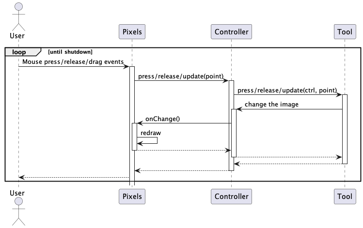

# Pixels

Det fantastiske Pixels tegneprogram.

## Udvikling

Den nemmeste måde at udvikle på projektet er gennem terminalen.
For at køre jeres app kan i køre:

```
mvn javafx:run
```

Og for at teste jeres app kan I køre:

```
mvn verify
```

Dette generer også en code coverage rapport i `target/site/jacoco/index.html`, som I kan åbne vha. jeres browser.

### PlantUML

Du kan bruge PlantUML til at genere billeder som dette:



Der existere et plugin "PlantUML Integration" til Intellij som gør det nemt.
